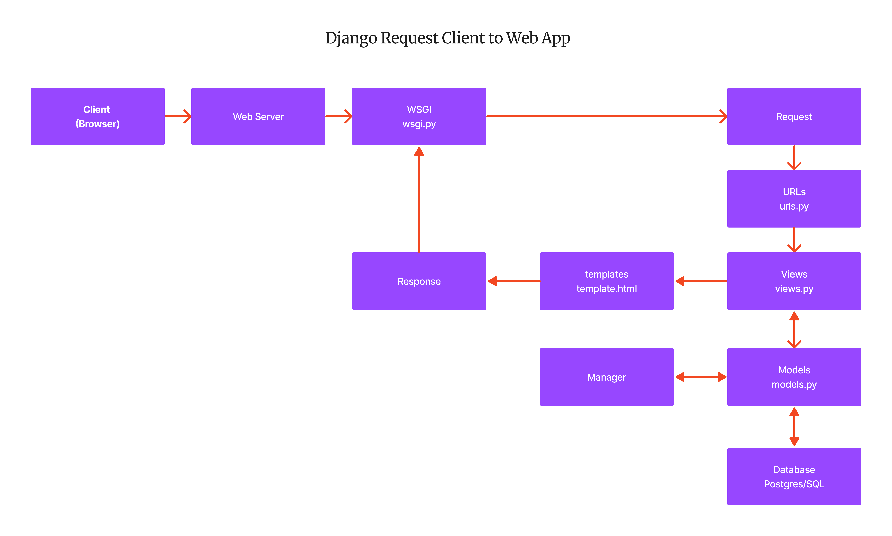

# **Tugas 2**

**Jelaskan bagaimana cara kamu mengimplementasikan checklist di atas secara step-by-step (bukan hanya sekadar mengikuti tutorial).**

- [1] Membuat sebuah proyek Django baru.
  - Memulai dengan membuat direktori baru lalu membuka new terminal pada direktori tersebut. Mengetik django-admin startproject inventory.
- [2] Membuat aplikasi dengan nama main pada proyek tersebut.
  - Lalu membuat aplikasi dengan nama main melalui django-admin startapp main.
- [3] Melakukan routing pada proyek agar dapat menjalankan aplikasi main.
  - Menambahkan alamat dengan menambahkan "main" di urls.py dari project. Untuk setiap url main akan menggunakan file urls.py di app main.
- [4]  Membuat model pada aplikasi main dengan nama Item dan memiliki atribut wajib sebagai berikut.
  - Menambahkan model dengan nama Item di models.py di app main dengan name bertipe CharField(), amount bertipe IntegerField(), description bertipa TextField().
- [5] Membuat sebuah fungsi pada views.py untuk dikembalikan ke dalam sebuah template HTML yang menampilkan nama aplikasi serta nama dan kelas kamu.
  - membuat fungsi dengan nama main_view dengan parameter request di views.py pada app main. Lalu fungsi tersebut mengembalikan template html
- [6] Membuat sebuah routing pada urls.py aplikasi main untuk memetakan fungsi yang telah dibuat pada views.py
  - Membuat file baru bernama urls.py di app main. Lalu membuat routing dengan alamat yang sama lalu mengimport fungsi view di views.py dan menjadikan fungsi view tersebut sebagai tampilan dari alamat urls.\
- [7] Melakukan deployment ke Adaptable terhadap aplikasi yang sudah dibuat sehingga nantinya dapat diakses oleh teman-temanmu melalui Internet.
  - Melakukan testing dengan python manage.py runserver dan python manage.py test. Lalu melakukan deploy di adaptable.

**Buatlah bagan yang berisi request client ke web aplikasi berbasis Django beserta responnya dan jelaskan pada bagan tersebut kaitan antara urls.py, views.py, models.py, dan berkas html.**

- Kaitan antara urls.py, views.py, models.py, dan berkas html adalah 
  - urls.py akan mendefinisikan atau memetakan alamat url yang akan diakses dengan viewsnya dalam django. misal alamat url /main akan mengakses fungsi main_view di views.py. 
  - Lalu views.py berfungsi untuk menangani request dari url dan mengembalikan misal data dari database, merender template html, dan mengembalikan response. 
  -  models.py berfungsi untuk mendefinisikan model data yang aplikasi django akan gunakan. Model ini akan disimpan di database dan dapat diakses melalui views.py. misal model Item yang memiliki atribut name, amount, dan description.
  -  berkas.html berisi template html yang akan merender halaman oleh views.py. misal template html yang akan menampilkan data dari context.

**Jelaskan mengapa kita menggunakan virtual environment? Apakah kita tetap dapat membuat aplikasi web berbasis Django tanpa menggunakan virtual environment?**
- Alasan mengapa kita menggunakan virtual environment adalah untuk membantu menyimpan dependency dan versi dari package yang dibutuhkan dari project dengan membedakannya melalui environment python yang terisolasi. Hal ini dapat memudahkan kita ketika kita ingin mengirimkan project ke orang lain atau ketika kita ingin mengembangkan project di komputer lain.
- Kita tetap dapat membuat aplikasi web django tanpa membuat virtual environment. Namun, terdapat kelemahan yaitu versi dependency yang digunakan akan menggunakan versi global dari python yang terinstall. Sehingga jika kita ingin melakukan operasi clone dan pull dari project besar di github yang menggunakan versi dependency yang berbeda, maka akan terjadi error karena versi dependency yang berbeda.

**Jelaskan apakah itu MVC, MVT, MVVM dan perbedaan dari ketiganya.**
- pola MVC atau Model-View-Controller adalah pola membuat aplikasi dengan 3 komponen yaitu model, view, controller. Controller dalam MVC akan menangani input dari user dan mengupdate model.View dari MVC akan menampilkan data ke user. Model dari MVC akan menyimpan dan mengakses data. Menggunakan MVC ketika aplikasi perlu membedakan model, controller, dan view.
- MVT atau Model-View-Presenter adalah pola membuat apliaksi dengan model view presenter. Controller dari MVT hanya menangani input dari user. View dari MVT akan menampilkan data ke user dan memperbarui model. Model dari MVT akan menyimpan dan mengakses data. 
- MVVM adalah Model View ViewModel adalah membuat aplikasi dengan model view viewmodel. Controller dari MVVM tidak memperbarui model secara langsung. View dari MVVM menampilkan data ke user. Model dari MVVM menyimpan dan mengakses data. MVVM digunakan ketika aplikasi perlu dibagikan ke desainer dan proses desain dan pengembangan dapat dilakukan secara independen.
