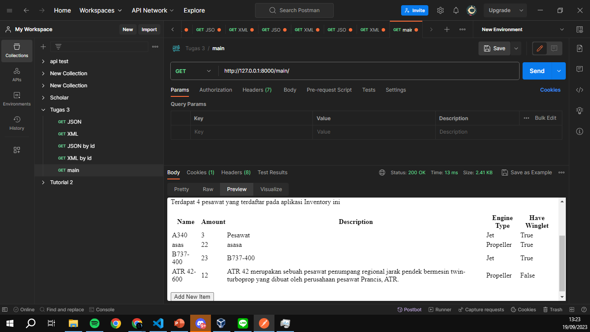
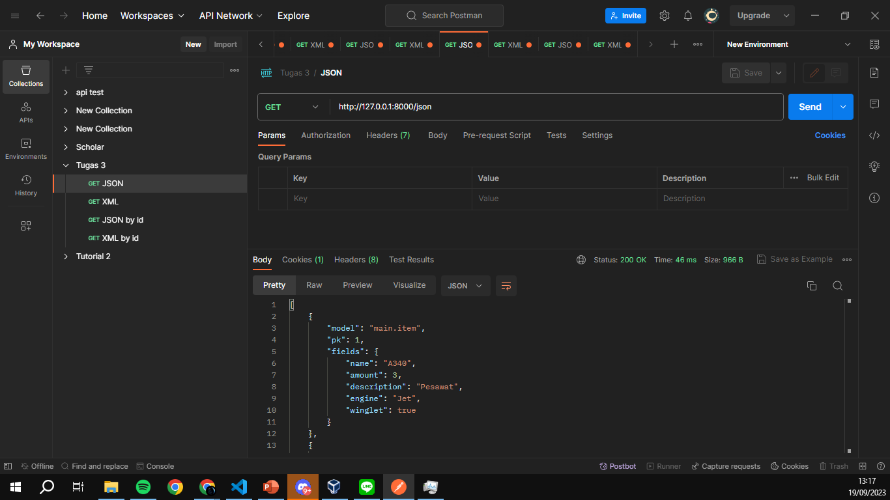
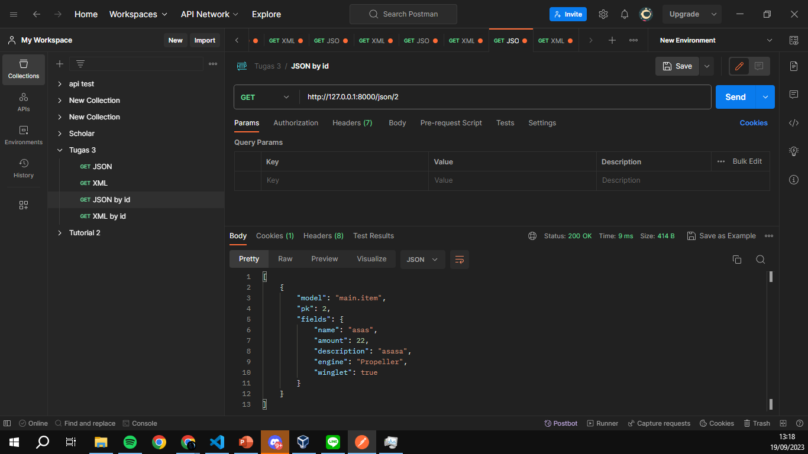
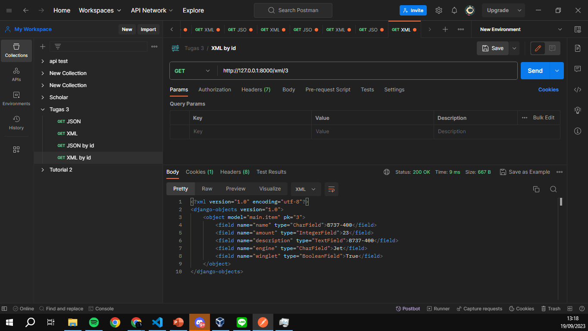

# **Pemrograman Berbasis Platform**

## **Daftar Isi**:

- [**Pemrograman Berbasis Platform**](#pemrograman-berbasis-platform)
  - [**Daftar Isi**:](#daftar-isi)
  - [**Tugas 1**](#tugas-1)
  - [**Tugas 2**](#tugas-2)
    - [**Implementasi Model-View-Template (MVT) pada Django**](#implementasi-model-view-template-mvt-pada-django)
  - [**Tugas 3**](#tugas-3)
    - [**Implementasi Form dan Data Delivery pada Django**](#implementasi-form-dan-data-delivery-pada-django)
  - [**Tugas 4**](#tugas-4)
    - [**Implementasi Autentikasi, Session, dan Cookies pada Django**](#implementasi-autentikasi-session-dan-cookies-pada-django)
  - [**Tugas 5**](#tugas-5)
  - [**Desain Web menggunakan HTML, CSS dan Framework CSS**](#desain-web-menggunakan-html-css-dan-framework-css)
  - [**Tugas 6**](#tugas-6)
    - [**JavaScript dan Asynchronous JavaScript**](#javascript-dan-asynchronous-javascript)
---
## **Tugas 1**

Dapat diakses di [Tugas 1](https://docs.google.com/document/d/18LlGQgYADs7vUt7ymD71-ySPDvE9NGB-37oUFy1Swz0/edit?usp=sharing)

---
## **Tugas 2**

### **Implementasi Model-View-Template (MVT) pada Django**

**Jelaskan bagaimana cara kamu mengimplementasikan checklist di atas secara step-by-step (bukan hanya sekadar mengikuti tutorial).**

- [1] Membuat sebuah proyek Django baru.
  - Memulai dengan membuat direktori baru lalu membuka new terminal pada direktori tersebut. Mengetik django-admin startproject inventory. Lalu akan muncul project bernama inventory dengan file manage.py dan folder inventory.
- [2] Membuat aplikasi dengan nama main pada proyek tersebut.
  - Lalu membuat aplikasi dengan nama main melalui django-admin startapp main. Lalu akan muncul folder bernama main dengan file admin.py, apps.py, models.py, tests.py, dan views.py.
- [3] Melakukan routing pada proyek agar dapat menjalankan aplikasi main.
  - Menambahkan alamat dengan menambahkan "main" di urls.py dari project. Untuk setiap url main akan menggunakan file urls.py di app main.
- [4]  Membuat model pada aplikasi main dengan nama Item dan memiliki atribut wajib sebagai berikut.
  - Menambahkan model dengan nama Item di models.py di app main dengan name bertipe CharField(), amount bertipe IntegerField(), description bertipa TextField(). Lalu melakukan migrasi dengan python manage.py makemigrations dan python manage.py migrate untuk menyimpan model ke database.
- [5] Membuat sebuah fungsi pada views.py untuk dikembalikan ke dalam sebuah template HTML yang menampilkan nama aplikasi serta nama dan kelas kamu.
  - membuat fungsi dengan nama main_view dengan parameter request di views.py pada app main. Lalu fungsi tersebut mengembalikan template html dengan nama main.html terformat yang berisi context yang diisi dengan nama aplikasi dan nama serta kelas dan dummy inventory.
- [6] Membuat sebuah routing pada urls.py aplikasi main untuk memetakan fungsi yang telah dibuat pada views.py
  - Membuat file baru bernama urls.py di app main. Lalu membuat routing dengan alamat yang sama setelah itu mengimport fungsi view di views.py dan menjadikan fungsi view tersebut sebagai tampilan dari alamat urls. Diisi dengan path yang kosong karena nama main sudah ditulis di urls.py project.
- [7] Melakukan deployment ke Adaptable terhadap aplikasi yang sudah dibuat sehingga nantinya dapat diakses oleh teman-temanmu melalui Internet.
  - Melakukan testing dengan python manage.py runserver dan python manage.py test. Lalu melakukan deploy di adaptable. Link Adaptable : [https://plane-inventory.adaptable.app/](https://plane-inventory.adaptable.app/main)
  

**Buatlah bagan yang berisi request client ke web aplikasi berbasis Django beserta responnya dan jelaskan pada bagan tersebut kaitan antara urls.py, views.py, models.py, dan berkas html.**

- Kaitan antara urls.py, views.py, models.py, dan berkas html adalah 
  - urls.py akan mendefinisikan atau memetakan alamat url yang akan diakses dengan viewsnya dalam django. misal alamat url /main akan mengakses fungsi main_view di views.py. 
  - Lalu views.py berfungsi untuk menangani request dari url dan mengembalikan misal data dari database, merender template html, dan mengembalikan response. 
  -  models.py berfungsi untuk mendefinisikan model data yang aplikasi django akan gunakan. Model ini akan disimpan di database dan dapat diakses melalui views.py. misal model Item yang memiliki atribut name, amount, dan description.
  -  berkas.html berisi template html yang akan merender halaman oleh views.py. misal template html yang akan menampilkan data dari context.

Referensi:
- [https://www.technoarchsoftwares.com/blog/django-request-response-cycle/](https://www.technoarchsoftwares.com/blog/django-request-response-cycle/)
- [https://learnbatta.com/blog/understanding-request-response-lifecycle-in-django-29/](https://learnbatta.com/blog/understanding-request-response-lifecycle-in-django-29/)

**Jelaskan mengapa kita menggunakan virtual environment? Apakah kita tetap dapat membuat aplikasi web berbasis Django tanpa menggunakan virtual environment?**
- Alasan mengapa kita menggunakan virtual environment adalah untuk membantu menyimpan dependency dan versi dari package yang dibutuhkan dari project dengan membedakannya melalui environment python yang terisolasi. Hal ini dapat memudahkan kita ketika kita ingin mengirimkan project ke orang lain atau ketika kita ingin mengembangkan project di komputer lain.
- Kita tetap dapat membuat aplikasi web django tanpa membuat virtual environment. Namun, terdapat kelemahan yaitu versi dependency yang digunakan akan menggunakan versi global dari python yang terinstall. Sehingga jika kita ingin melakukan operasi clone dan pull dari project besar di github yang menggunakan versi dependency yang berbeda, maka akan terjadi error karena versi dependency yang berbeda.

Referensi: 
- [https://towardsdatascience.com/why-you-should-use-a-virtual-environment-for-every-python-project-c17dab3b0fd0](https://towardsdatascience.com/why-you-should-use-a-virtual-environment-for-every-python-project-c17dab3b0fd0)
- [https://www.geeksforgeeks.org/python-virtual-environment/#:~:text=A%20virtual%20environment%20is%20a,that%20most%20Python%20developers%20use.](https://www.geeksforgeeks.org/python-virtual-environment/#:~:text=A%20virtual%20environment%20is%20a,that%20most%20Python%20developers%20use.)

**Jelaskan apakah itu MVC, MVT, MVVM dan perbedaan dari ketiganya.**
- pola MVC atau Model-View-Controller adalah pola membuat aplikasi dengan 3 komponen yaitu model, view, controller. Controller dalam MVC akan menangani input dari user dan mengupdate model.View dari MVC akan menampilkan data ke user. Model dari MVC akan menyimpan dan mengakses data. Menggunakan MVC ketika aplikasi perlu membedakan model, controller, dan view. MVC hanya dapat digunakan untuk aplikasi yang besar dan tidak ada pemetaan url. Pada MVC View memberi tahu bagaimana data akan diperlihatkan. 
- MVT atau Model-View-Template adalah pola membuat aplikasi dengan 3 komponen yaitu model, view, template. View dari MVT akan merender model atau data ke template html. Perbedaannya dari MVC adalah Controller MVT sudah ditangani oleh framework, mudah dimodifikasi, url perlu dipetakan, dan bisa digunakan di aplikasi yang kecil dan besar.
- MVVM adalah Model View ViewModel adalah membuat aplikasi dengan model view viewmodel. Controller dari MVVM tidak memperbarui model secara langsung. View dari MVVM menampilkan data ke user. Model dari MVVM menyimpan dan mengakses data. MVVM digunakan ketika aplikasi perlu dibagikan ke desainer dan proses desain dan pengembangan dapat dilakukan secara independen.

Referensi: 
- [https://www.geeksforgeeks.org/difference-between-mvc-and-mvt-design-patterns/](https://www.geeksforgeeks.org/difference-between-mvc-and-mvt-design-patterns/)
- [https://www.geeksforgeeks.org/difference-between-mvc-mvp-and-mvvm-architecture-pattern-in-android/](https://www.geeksforgeeks.org/difference-between-mvc-mvp-and-mvvm-architecture-pattern-in-android/)
  

---

## **Tugas 3**

### **Implementasi Form dan Data Delivery pada Django**

**Apa perbedaan antara form POST dan form GET dalam Django?**
- Terdapat beberapa perbedaan anatara form POST dan form GET di Django. 
  - Form POST misal pada form login pada django, browser akan mengkonversi data dari form yang diisi menjadi format yang aman atau encoded. Setelah itu data yang encoded dikitim ke server dalam body HTTP request. Lalu server akan mendekode data tersebut dan mengembalikan response. Sedangkan pada post GET data yang diisi pada form akan dikirim pada bentuk string dan digunakan untuk membuat url. URL-nya nanti akan berisi alamat tujuan pengiriman data dan pasangan kunci dan nilai data yang diisi. Jadi misal dalam login data kurang aman.
  - Form POST dalam django dapat mengirimkan data yang lebih beragam daripada form GET. Form POST dapat mengirimkan data dalam bentuk file, sedangkan form GET hanya dapat mengirimkan data dalam bentuk string.
  - form POST lebih banyak digunakan untuk membuat atau mengubah data yang ada di server. Sedangkan form GET lebih banyak digunakan untuk mengambil data dari server.

Referensi: 
- [https://docs.djangoproject.com/en/4.2/topics/forms/#:~:text=Django's%20login%20form%20is%20returned,this%20to%20compose%20a%20URL.](https://docs.djangoproject.com/en/4.2/topics/forms/#:~:text=Django's%20login%20form%20is%20returned,this%20to%20compose%20a%20URL.)

**Apa perbedaan utama antara XML, JSON, dan HTML dalam konteks pengiriman data?**
- HTML (*HyperText Markup Language*) dalam konteks pengiriman data adalah untuk menampilkan data ke user dalam bentuk yang lebih visual dan terstruktur. HTML dapat menampilkan data dalam bentuk yang lebih tervisualisasi seperti tabel, list, gambar, bentuk tulisan yang diformat, dan lain-lain ke halaman web. HTML dapat menampilkan data yang diambil dari server atau data yang sudah ada di client.
- XML (*Extensible Markup Language*) dalam konteks pengiriman data adalah untuk menyimpan, mengirim, dan merekontruksi data yang masih kasar menjadi data yang terstruktur dengan tag untuk penandaan data. XML biasanya digunakan untuk mengirim data antara aplikasi yang berbeda seperti servis web dan sistem perusahaan.
- JSON (*JavaScript Object Notation*) dalam konteks pengiriman data adalah untuk menserialisai dan mengirim data melalui koneksi jaringan seperti internet. Biasanya JSON digunakan untuk mengirim data antara server dan aplikasi web dengan permintaan API. JSON adalah data yang terstruktur karena terdiri dari pasangan key dan value dan dapat dibaca oleh manusia dan komputer.

Referensi:
- [https://www.deltaxml.com/blog/xml/whats-the-relationship-between-xml-json-html-and-the-internet/](https://www.deltaxml.com/blog/xml/whats-the-relationship-between-xml-json-html-and-the-internet/)
- [https://www.w3schools.com/js/js_json_xml.asp](https://www.w3schools.com/js/js_json_xml.asp)

**Mengapa JSON sering digunakan dalam pertukaran data antara aplikasi web modern?**
- JSON sering digunakan dalam pertukaran data antara aplikasi web modern karena
  - Pertama JSON adalah data yang bentuknya simple dan mudah dibaca oleh manusia dan komputer. JSON hanya membutuhkan pasangan key dan value dan juga array agar dapat mudah dimengerti oleh manusia.
  - Kedua JSON adalah data yang kompatibel dengan platform, bahasa pemrograman, dan framework yang berbeda. JSON mendukung sebagian besar browser modern, server web, dan web API yang membuatnya mudah digunakan untuk saling menukar data diantara sistem dan lingkungan yang berbeda.
  -   Ketiga JSON memiliki performa yang lebih efisien sebagai format data untuk aplikasi web daripada XML. JSON memiliki ukuran yang lebih kecil dan struktur yang lebih simple.
  

Referensi:
- [https://www.linkedin.com/advice/3/what-benefits-drawbacks-using-json-data#:~:text=One%20of%20the%20main%20benefits,data%20format%20for%20web%20applications.](https://www.linkedin.com/advice/3/what-benefits-drawbacks-using-json-data#:~:text=One%20of%20the%20main%20benefits,data%20format%20for%20web%20applications.)


**Jelaskan bagaimana cara kamu mengimplementasikan checklist di atas secara step-by-step (bukan hanya sekadar mengikuti tutorial).**
- [1] Membuat input form untuk menambahkan objek model pada app sebelumnya.
  - Membuat file form dengan nama forms.py lalu menambahkan class dengan nama ItemForm yang menjadi form untuk model Item untuk menambahkan objek tambahan ke database yang menambahkan objek dengan mengisi field name, amount, dan description. 
- [2] Tambahkan 5 fungsi views untuk melihat objek yang sudah ditambahkan dalam format HTML, XML, JSON, XML by ID, dan JSON by ID.
  - Menambahkan fungsi views untuk melihat objek dengan format yang ditentukan yaitu HTML, XML, dan JSON.
  - Membuat fungsi untuk menglakukan view pada objek dengan format JSON yaitu dengan membuat fungsi show_json dan show_json_by_id dengan parameter request sebagai request dari user ke django. Lalu untuk fungsi show_json membuat variable data dengan seluruh Item akan diambil dan di kembalikan dalam bentuk json dengan HttpResponse yang dilakukan serialize dengan format json dengan content_type application/json. Lalu untuk fungsi show_json_by_id sama seperti show_json namun dalam membuat variable data, model Item perlu difilter berdasarkan id.
  - Membuat fungsi untuk menglakukan view pada objek dengan format XML yaitu dengan membuat fungsi show_xml dan show_xml_by_id dengan parameter request sebagai request dari user ke django. Lalu untuk fungsi show_xml membuat variable data dengan seluruh Item akan diambil dan di kembalikan dalam bentuk xml dengan HttpResponse yang dilakukan serialize dengan format xml dengan content_type application/xml. Lalu untuk fungsi show_xml_by_id sama seperti show_xml namun dalam membuat variable data, model Item perlu difilter berdasarkan id.
  - Membuat fungsi untuk melakukan view dengan template html adalah dengan membuat fungsi main_view dengan parameter request lalu membuat variable context sebagai isi dari context di html dan context berisi nama aplikasi, nama, kelas, dan isi dari inventory seluruhnya yang mana menggunakan object Item dan all(). Lalu mengembalikan render dengan request, nama template yaitu main.html, dan context.

- [3]  Membuat routing URL untuk masing-masing views yang telah ditambahkan pada poin 2.
  - Pada file urls.py di folder atau app main, menambahkan path "json/" untuk mengakses fungsi show_json untuk melihat seluruh objek dengan format json, path "json/int:id" untuk mengakses fungsi show_json_by_id dan int:id tersebut akan diisi id dari objek Item, path "xml/" untuk mengakses fungsi show_xml untuk melihat seluruh objek dengan format xml, path "xml/int:id" untuk mengakses fungsi show_xml_by_id dan int:id tesebut akan diisi id dari objek Item, dan path "main/" untuk mengakses fungsi main_view yang akan mengembalikan template html.

- [4] Mengakses kelima URL di poin 2 menggunakan Postman, membuat screenshot dari hasil akses URL pada Postman, dan menambahkannya ke dalam README.md.
  - Membuka Postman lalu menambahkan workspace untuk tugas 3 dan menambahkan request untuk ke semua url pada views yang telah dibuat.
  - HTML views
  - 
  - JSON views
  - 
  - XML views
  - 
  - JSON by ID views
  - 
  - XML by ID views
  - 
- [5]  Melakukan add-commit-push ke GitHub.
  - Membuat branch baru bernama development sebagai proses staging dengan *git checkout -b development*.
  - Menambahkan semua file yang telah dibuat dan telah di edit dengan *git add .*
  - Melakukan commit dengan *git commit -m "Menambahkan hasil dari tugas 3"* untuk menyimpan perubahan.
  - Melakukan push ke repository dengan *git push origin development* agar hasil dari tugas 3 dapat dilihat di github.
- [6] Menambahkan pesan "Kamu menyimpan X item pada aplikasi ini" (dengan X adalah jumlah data item yang tersimpan pada aplikasi) dan menampilkannya di atas tabel data. Kalimat pesan boleh dikustomisasi sesuai dengan tema aplikasi, namun harus memiliki makna yang sama.
  - Menambahkan context pada fungsi main_view dengan nama **jumlah_item** yang berisi jumlah item yang ada di database dengan len(items). Lalu pada file html menambahkan kalimat "Kamu menyimpan {{ jumlah_item }} item pada aplikasi ini" di atas tabel data. {{jumlah_item}} akan mengambil value dari pasangan key value di context dari key **jumlah_item**.

---

## **Tugas 4**

### **Implementasi Autentikasi, Session, dan Cookies pada Django**

**Apa itu Django `UserCreationForm`, dan jelaskan apa kelebihan dan kekurangannya?**
- Django UserCreationForm adalah form yang sudah dibuat oleh django untuk membuat user baru pada aplikasi web yang dibuat dan UserCreationForm mewarisi ModelForm. UserCreationForm memiliki field username, password1, dan password2(konfirmasi password). 
- Kelebihan dari UserCreationForm adalah mudah digunakan karena sudah dibuat builtin oleh django dan dapat digunakan untuk membuat user baru. Kelebihan kedua adalah dapat menambahkan field baru hanya dengan membuat anak class dari UserCreationForm.
-  UserCreationForm memiliki kekurangan yaitu tidak dapat digunakan untuk membuat user dengan field yang lebih banyak seperti email, nama, dan lain-lain dan jika ingin membuat field baru maka harus membuat anak class dari UserCreationForm. Kekurangan kedua adalah sulit untuk dimaintain karena UserCreationForm sulit untuk dikustomisasi.

Referensi : 

- [https://www.javatpoint.com/django-usercreationform](https://www.javatpoint.com/django-usercreationform)
- 

**Apa perbedaan antara autentikasi dan otorisasi dalam konteks Django, dan mengapa keduanya penting**
- Autentikasi Django adalah proses untuk memverifikasi user yang ingin mengakses aplikasi web. Jadi django akan mengecek apakah user sudah terdaftar di database atau belum. Autentikasi dapat dilakukan dengan username dan password atau dengan token. Dalam authentisikasi django mendukung akun user, grup user, permissions, proses cookie based. Autentikasi penting karena dapat membatasi user yang dapat mengakses aplikasi web.

- Otorisasi adalah proses untuk memverifikasi hak akses user yang telah terautentikasi oleh django. Jadi django akan mengecek tingkat akses dari user di database. Otorisasi dapat dilakukan dengan mengecek permission yang dimiliki user yaitu fitur yang dapat diakses oleh user. Otorisasi penting karena dapat membatasi user yang telah terautentikasi untuk mengakses fitur-fitur yang ada di aplikasi web agar pengakses aplikasi web tidak melakukan hal yang tidak bertanggung jawab terhadap suatu fitur.

Referensi :
- [https://frontegg.com/blog/django-authentication](https://frontegg.com/blog/django-authentication)
- [https://docs.djangoproject.com/en/4.2/topics/auth/default/](https://docs.djangoproject.com/en/4.2/topics/auth/default/)

**Apa itu *cookies* dalam konteks aplikasi web, dan bagaimana Django menggunakan cookies untuk mengelola data sesi pengguna?**
- Cookies adalah data teks yang disimpan di browser atau penyimpanan lokal yang dapat digunakan untuk menyimpan data yang dibutuhkan untuk aplikasi web untuk mengidentifikasi komputer ketika mengakses website. Cookies dapat digunakan untuk menyimpan data yang dibutuhkan untuk aplikasi web seperti data login, data keranjang belanja, dan lain-lain. 
- Django menggunakan cookies untuk mengelola data sesi pengguna dengan menyimpan session id di cookies dengan anonim atau terenkripsi. Session pada django akan menyimpan data di server dan mengembalikan cookies yang berupa session id.  Session id digunakan untuk mengidentifikasi user yang telah terautentikasi dan mengakses aplikasi web.

Referensi: 
- [https://www.kaspersky.com/resource-center/definitions/cookies](https://www.kaspersky.com/resource-center/definitions/cookies)
- [https://www.kaspersky.com/resource-center/definitions/cookies](https://www.kaspersky.com/resource-center/definitions/cookies)

**Apakah penggunaan cookies aman secara default dalam pengembangan web, atau apakah ada risiko potensial yang harus diwaspadai?**
- Penggunaan cookies aman secara default dalam pengembangan web karena cookies hanya dapat diakses oleh server yang membuat cookies tersebut dan cookies hanya menyimpan data seperti history browsing, website permissions, dan pengaturan website. 
- Namun, terdapat risiko potensial yang harus diwaspadai yaitu cookies dapat digunakan untuk melacak user dan cookies dapat digunakan untuk menyimpan data yang tidak aman seperti data login dan session id misal pada django sehingga kriminal dapat berpura pura menjadi user. 
- Cookies dapat dibajak oleh kriminal untuk mendapatkan akses pada data browser. Kriminal dapat menggunakan cookies untuk mendapatkan data login dan mengakses akun user karena data cookies dapat diambil ketika terjadi transfer antara server dan browser.

Referensi :
- [https://allaboutcookies.org/what-is-a-cookie-file#:~:text=These%20are%20small%20pieces%20of,access%20to%20your%20browsing%20data.](https://allaboutcookies.org/what-is-a-cookie-file#:~:text=These%20are%20small%20pieces%20of,access%20to%20your%20browsing%20data.)
- [https://www.kaspersky.com/resource-center/definitions/cookies](https://www.kaspersky.com/resource-center/definitions/cookies)

**Jelaskan bagaimana cara kamu mengimplementasikan checklist di atas secara step-by-step (bukan hanya sekadar mengikuti tutorial).**
- [1] Mengimplementasikan fungsi registrasi, login, dan logout untuk memungkinkan pengguna untuk mengakses aplikasi sebelumnya dengan lancar.
  - Membuat fungsi baru yaitu registrasi, login_user, logout_user. 
  - pada fungsi register, menggunakna UserCreationForm() lalu memastikan jika request method adalah POST maka akan membuat UserCreationForm dengan POST. Jika input yang di isi pada form valid maka akan membuat user baru dan user akan disimpan.
  - pada fungsi login_user, memastikan jika request method adalah POST lalu meminta isian dari form dengan tag username dan password dimasukkan ke variable masing masing. Setelah itu dilakukan authenticate dengan username dan password yang dimasukkan. Jika user terautentikasi maka akan dilakukan login dengan login(request, user) dan mengembalikan redirect ke halaman utama atau halaman main.
  - pada fungsi logout_user, menggunakan library logout request lalu mengembalikan redirect ke halaman login dan menghapus session atau cookies.
- [2] Membuat dua akun pengguna dengan masing-masing tiga dummy data menggunakan model yang telah dibuat pada aplikasi sebelumnya untuk setiap akun di lokal.
  - Membuat 2 akun yaitu dengan memasuki halaman register dan membuat akun dengan memasuki username dan password. Username yang digunakan adalah Sofita dan DekDepe. Lalu login di halaman login dengan mengisi username dan password yang terdaftar.Setelah itu menambahkan 3 item ke ke inventory dengan memasuki halaman add new item. 
- [3]  Menghubungkan model Item dengan User.
  - Memodifikasi model Item dengan menambahkan field user dengan ForeignKey ke model User. Model User didapat dari library django.contrib.auth.models. Model ini membolehkan nilai field user untuk null dan blank.
- [4] Menampilkan detail informasi pengguna yang sedang logged in seperti username dan menerapkan cookies seperti last login pada halaman utama aplikasi.
  - Menambahkan detail informasi dengan yaitu menyimpan waktu login dengan cookies yang diinisiasi oleh fungsi login_user dengan `response.set_cookie("last_login", str(datetime.datetime.now()))`. Lalu informasi itu dimasukkan ke context dengan nama last_login dan pengguna_login. Lalu pada halaman main.html menambahkan kalimat **"Sedang login {{pengguna_login}} pada waktu {{last_login}}"**. 
- [5] Melakukan add-commit-push ke GitHub.
  - Melakukan `git add .`. lalu melakukan commit dengan `git commit -m "Menambahkan hasil dari tugas 4"` untuk menyimpan perubahan pada file atau aplikasi. Lalu melakukan push ke repository dengan `git push origin development` agar hasil dari tugas 4 dapat dilihat di github dan melakukan pull request di github untuk melakukan merge ke branch main.
- [6] Tambahkan tombol dan fungsi untuk menambahkan amount suatu objek sebanyak satu dan tombol untuk mengurangi jumlah stok suatu objek sebanyak satu.
  - Menambahkan kolom baru yaitu add amount dan menjadikan button sebagai isi dari kolom yang akan menambahkan amount ke item. Yaitu dengan menambahkan fungsi add_amount di views.py dengan mempassing parameter id dari item lalu mengambil amount dari item dan ditambahkan satu lalu di simpan atau di `save()`, menambahkan path add_amount di urls.py.
- [7] Tambahkan tombol dan fungsi untuk menghapus suatu objek dari inventory.
  - Menambahkan kolom baru yaitu delete_data di tabel dan menjadikan button sebagai isi dari delete data. Lalu membuat fungsi delete_data di views.py dengan mengambil parameter id lalu item di minta berdasarkan id lalu item di `delete()` lalu menambahkan path delete_data di urls.py.

---
## **Tugas 5**
## **Desain Web menggunakan HTML, CSS dan Framework CSS**

**Jelaskan manfaat dari setiap element selector dan kapan waktu yang tepat untuk menggunakannya**
  - Element selector, adalah selector yang digunakan untuk memilih elemen HTML berdasarkan nama elemen. Element selector ditandai dengan nama elemen, seperti h1, p, div, span, dll. Element selector akan memilih semua elemen dengan nama elemen yang ditentukan karena bersifat umum. Element selector lebih baik digunakan ketika membutuhkan styling yang sama untuk elemen elemen yang sama. Contohnya pada melakukan pewarnaan latar belakang pada element utama seperti header, body, dan footer. Element selector lebih baik digunakan pada kasus ini karena akan memilih semua elemen yang sama dan akan memudahkan dalam melakukan styling karena dalam pewarnaan latar belakang adalah hal yang memerlukan styling secara umum. 
  - ID selector, adalah selector yang memilih elemen berdasarkan id elemen. ID dalam html ditandai dengan `id="nama_id"`. ID selector akan memilih elemen dengan id yang ditentukan. ID selector ditandai dengan tanda `#nama_id`. ID selector melakukan styling pada id elemen di html dan karena id elemen di html bersifat unik maka ID selector akan memilih elemen yang unik. ID selector lebih baik digunakan ketika membutuhkan styling yang berbeda untuk elemen yang berbeda. Contohnya pada melakukan styling pada elemen yang unik juga di html misalnya seperti gambar atau carousel pada halaman depan website. Gambar atau carousel pada halaman depan website hanya berjumlah 1 dan ini lebih baik menggunakan id dan id selector untuk melakukan styling karena bersifat khusus pada elemen yang unik.
  - Class selector, adalah selector yang memilih elemen berdasarkan class elemen. Class dalam html ditandai dengan `class="nama_class"`. Class selector akan memilih elemen pada class yang ditentukan. Class selector ditandai dengan `.nama_class`. Class selector akan melakukan styling pada class elemen di html. Class pada html bersifat mengkelompokan sesuatu yang sama atau memiliki kesamaan. Contohnya pada melakukan styling pada button di html. Button di html biasanya ada banyak dan memiliki kesamaan. Jadi lebih baik menggunakan class selector pada button karena memiliki kesamaan dan akan memudahkan dalam melakukan styling.

Referensi:
- [https://stackoverflow.com/questions/46924587/html-id-vs-class-best-practice](https://stackoverflow.com/questions/46924587/html-id-vs-class-best-practice)

**Jelaskan HTML5 Tag yang kamu ketahui.**
 - `<h1>,<h2>,<h3>,<h4>,<h5>`, adalah tag yang digunakan untuk membuat judul dan subjudul pada halaman website. Tag ini memiliki level yang berbeda dan semakin besar levelnya maka semakin kecil ukuran fontnya.
 - `<p>` adalah tag yang digunakan untuk membuat paragraf atau tulisan atau kalimat pada halaman website. Tag ini akan membuat paragraf baru setelah tag ini dan dapat diisi dengan paragraf yang panjang dan website akan membuat baris baru jika paragraf sudah penuh.
 - `<div>` adalah tag yang digunakan untuk melakukan pembagian suatu halaman website menjadi bagian bagian. Pada kasus umum, tag ini digunakan untuk membuat header, body, navbar, footer, dan lain lain. Tag ini digunakan untuk diisi dengan tag lainnya.
 - `<script>` adalah tag yang digunakan untuk melakukan penambahan scripting javascript pada halaman website untuk melakan logic dari website.
 - `<style>` adalah tag yang digunakan untuk menambahkan desain pada halaman website dengan menggunakan css untuk membuat website menjadi lebih menarik dan tervisualisasi.
 - `<link>` adalah tag yang digunakan untuk menambahkan link atau memindahkan tujuan ke halaman website dengan `href`. Tag ini digunakan untuk menambahkan link ke css, javascript, dan lain lain. 
 - `<title>` adalah tag yang digunakan untuk menambahkan judul atau nama website pada halaman website yang akan ditampilkan pada tab browser.

Referensi :
- [https://www.tutorialspoint.com/html5/html5_tags.htm](https://www.tutorialspoint.com/html5/html5_tags.htm)

**Jelaskan perbedaan antara margin dan padding.**
  - Margin adalah menambahkan ruang diluar atau sekitar element. Margin digunakan untuk melakukan perpindahan elemen ke semua arah. Margin sama seperti menambahkan elemen disamping elemen untuk memindahkan namun elemen tersebut adalah elemen kosong atau tranparan. Jadi diantara margin itu tidak bisa menambahkan elemen dan akan mendorong elemen biasa disampingnya.
  - Padding adalah menambahkan ruang didalam element(elemen2). Padding digunakan untuk melakukan perpindahan elemen(elemen1) didalam elemen(elemen2) itu sendiri untuk melihat bagaimana lokasi elemen(elemen1) itu berada pada didalam elemen(elemen2) itu. Padding akan membesarkan atau mengecilkan elemen(elemen1) didalam elemen(elemen2) itu sendiri. 

Referensi: 
- [https://www.geeksforgeeks.org/css-padding-vs-margin/](https://www.geeksforgeeks.org/css-padding-vs-margin/)

**Jelaskan perbedaan antara framework CSS Tailwind dan Bootstrap. Kapan sebaiknya kita menggunakan Bootstrap daripada Tailwind, dan sebaliknya?**
 -  Bootstrap adalah salah satu framework CSS yang memiliki alat untuk responsive web design, sistem grid, dan komponen yang sudah jadi seperti buttons, form, card, dan navbar. Tailwind adlah salah satu framework CSS yang memiliki alat untuk melakukan responsive web design dengan low level dan dapat dikustomisasi sendiri. Tailwind menawarkan utility class yang dapat digunakan untuk melakukan styling.
 -  Bootstrap lebih baik digunakan ketika ingin membuat website dengan solusi yang konsisten, siap jadi, dan mudah digunakan karena sudah memiliki komponen untuk semua skenario dan menghemat waktu. Tailwind lebih baik digunakan ketika ingin membuat website dengan solusi yang dapat dikustomisasi dan memiliki kontrol yang lebih besar. Tailwind juga lebih baik digunakan ketika ingin membuat website dengan desain yang unik dan tidak biasa karena kekuatan kustomisasinya yang mencangkup seluruh aspek desain.

Referensi :
- [https://www.linkedin.com/advice/3/what-pros-cons-using-bootstrap-vs-tailwind-responsive](https://www.linkedin.com/advice/3/what-pros-cons-using-bootstrap-vs-tailwind-responsive#:~:text=Generally%2C%20Bootstrap%20is%20a%20great,every%20aspect%20of%20web%20design.)

**Checklist untuk tugas ini adalah sebagai berikut:**
  - **Kustomisasi desain pada templat HTML yang telah dibuat pada Tugas 4 dengan menggunakan CSS atau CSS framework (seperti Bootstrap, Tailwind, Bulma) dengan ketentuan sebagai berikut**
    - **[1]Kustomisasi halaman login, register, dan tambah inventori semenarik mungkin.**
      - Melakukan kustomisasi halaman login yaitu menggunakan login form dari bootstrap. Formnya dimasukkan ke suatu Container dan menambahkan gambar disamping login formnya. Untuk halaman register membagi halaman menjadi 2 bagian yaitu bagian kiri untuk melakukan halman register dan bagin kanan berisi guidelines tentang bagaimana syarat username dan password dari melakukan register di aplikasi ini. Untuk halaman tambah inventori dengan membuat form berisi form model Item untuk semua atribut model dan sama seperti form lainnya semua form dimasukkan ke sebuah container dan melakukan pembagian `div` yang berisi label dari form dan field form. 
    - **[2] Kustomisasi halaman daftar inventori menjadi lebih berwarna maupun menggunakan apporach lain seperti menggunakan Card.**
      - Melakukan pembagian 1 row dan 2 column dengan kolom pertama adalah kolom yang berisi gambar dari item dan kolom kedua berisi card yang berisi informasi dari setiap objek. Card ini berisi nama, amount, engine, winglet dan description dari objek. Card ini juga memiliki button untuk menambahkan amount dan menghapus objek.


---

## **Tugas 6**
### **JavaScript dan Asynchronous JavaScript**

**Jelaskan perbedaan antara asynchronous programming dengan synchronous programming.**
- asynchronous programming adalah pendekatan pemrograman yang tidak terikat pada protokol input output  yaitu dapat melakukan eksekusi program dengan cara paralel yang berarti program dieksekusi secara bersamaan dan tidak memerlukan program yang berjalan terlebih dahulu selesai dan tidak berjalan secara sequential tatau terurut.
- synchronus programming adalah pendekatan pemrograman yang melakukan eksekusi secara urutan satu persatu dan prioritas task tidak bisa diinterupsi samapi task yang berjalan selesai. Setiap task harus menunggu task sebelumnya selesai baru dapat dijalankan.
- asynchronus programming memiliki kecepatan eksekusi yang lebih baik karena dapat melakukan eksekusi secara bersamaan dan tidak memerlukan task sebelumnya selesai. Synchronus programming memiliki kecepatan eksekusi yang lebih lambat karena harus menunggu task sebelumnya selesai.
- asynchronus programming membutuhkan lebih banyak memory karena harus menyimpan task yang belum selesai. Synchronus programming membutuhkan lebih sedikit memory karena tidak perlu menyimpan task yang belum selesai.
- asynchronus programming lebih konkuren karena dapat melakukan eksekusi secara bersamaan. Synchronus programming tidak konkuren karena harus menunggu task sebelumnya selesai.
- asynchronus programming memiliki kemungkinan besar terjadi overhead karena melakukan task secara bersamaan.Synchronus programming memiliki kemungkinan overhead yang lebih kecil karena tidak perlu menyimpan task yang belum selesai.

Referensi :
- [https://datamyte.com/synchronous-vs-asynchronous/](https://datamyte.com/synchronous-vs-asynchronous/)
- [https://binus.ac.id/malang/2022/05/asynchronous-vs-synchronous-programming/](https://binus.ac.id/malang/2022/05/asynchronous-vs-synchronous-programming/)

**Dalam penerapan JavaScript dan AJAX, terdapat penerapan paradigma event-driven programming. Jelaskan maksud dari paradigma tersebut dan sebutkan salah satu contoh penerapannya pada tugas ini.**
- event driven programming adalah paradigma pemrograman yang jalannya program dikendalikan oleh suate event. Ada sebuah loop yang selalu mendengar terjadinya event. Jika terjadi event maka akan menjalankan fungsi yang terkait dengan event tersebut. 
- Contoh penerapannya adalah aksi pengguna dalam aplikasi GUI yang diatur oleh mouse, keyboard, touchscreen,dan lain lain. Jika pengguna melakukan aksi dengan mouse yang menekan tombol pada button. Aksi menekan mouse pada button dinamakan event. Jika terjadi event maka akan menjalankan fungsi yang terkait dengan event tersebut yaitu fungsi yang akan menjalankan aksi yang terjadi ketika tombol button ditekan.
  
Referensi :
- [https://en.wikipedia.org/wiki/Event-driven_programming](https://en.wikipedia.org/wiki/Event-driven_programming#:~:text=Event%2Ddriven%20programming%20is%20the,in%20USB%20device%20driver%20stacks)
- [https://www.tutorialspoint.com/concurrency_in_python/concurrency_in_python_eventdriven_programming.htm](https://www.tutorialspoint.com/concurrency_in_python/concurrency_in_python_eventdriven_programming.htm)

**Jelaskan penerapan asynchronous programming pada AJAX.**
- Asynchronous programming pada AJAX adalah AJAX tidak menunggu respon dari server. Ketika asynchrounour request menjalankan JavaScript eerus melakukan eksekusi pada task lainnya sampai response dari server diterima. JavaScript dapat melanjutkan eksekusi programnya yang lain sehingga membuat halaman menjadi lebih responsif selama menunggu respon dari server.

**Pada PBP kali ini, penerapan AJAX dilakukan dengan menggunakan Fetch API daripada library jQuery. Bandingkanlah kedua teknologi tersebut dan tuliskan pendapat kamu teknologi manakah yang lebih baik untuk digunakan.**
- Fetch API pada javascript adalah permintaan layanan ke url yang akan menerima request untuk mengambil response resource berupa XML atau JSON. 
- Penerapan Fetch API dari AJAX adalah melakukan permintaan HTTP request kepada server secara asynchronous. Pada AJAX, Fetch API menggunakan XMLHttpRequest untuk melakukan permintaan HTTP. 
- Fetch API pada jquery adalah melakukan permintaan HTTP request kepada server secara asynchronous. Pada jquery, Fetch API menggunakan $.ajax() untuk melakukan permintaan HTTP dan permintaan ini terdapat pada library dari jquery. 
- Fetch API pada AJAX memiliki kelebihan yaitu dapat melakukan permintaan HTTP request kepada server secara asynchronous dengan promise. Fetch API pada AJAX juga lebih ringan karena hanya mencangkup AJAX sehingga mengurangi overhead. Fetch API pada AJAX juga lebih modern karena pemrogaman asynchronous memiliki dukungan pada browser modern.
- Fetch API pada jquery memiliki kelebihan yaitu sintaksnya yang lebih ringkas dan dapat dengan mudah dibaca. Library jquery juga didukung oleh sebagian besar browser. Library jquery juga memiliki fitur yang lebih lengkap dan lebih banyak.
- Menurut saya teknologi yang lebih baik digunakan adalah Fetch API pada AJAX karena Fetch API pada AJAX lebih ringan, lebih modern, dan memiliki dukungan pada browser yang kita gunakan dan untuk tugas PBP tidak memerlukan banyak fitur.

**Mengubah tugas 5 yang telah dibuat sebelumnya menjadi menggunakan AJAX.**
 - **AJAX GET**
    - **Ubahlah kode cards data item agar dapat mendukung AJAX GET.**
      - Menambahkan versi dari AJAX GET dibawah card. Card ini ditambah melalui javascript dengan membuat div dengan id `item_view` di html. Lalu menambhahkan fungsi refreshItems di javascript. fungsi refreshItems adalah fungsi yang mengembalikan card dengan dukungan AJAX. 
    - **Lakukan pengambilan task menggunakan AJAX GET.**
      - Menambahkan fungsi `get_item_json` di views.py. fungsi ini akan mengembalikan bentuk json dari model di database berdasarkan user. Lalu mengganti card sebelumnya dengan card yang baru yang ada di javascript atau script. Card yang baru akan mengambil data dari `get_item_json` lalu masuk ke fungsi `refreshItems` yang akan menerjemahkan data json menjadi card yang baru.
 - **AJAX POST**
   - **Buatlah sebuah tombol yang membuka sebuah modal dengan form untuk menambahkan item.**
      - Menambahkan button di bawah modalpada file html. Button ini akan memunculkan modal untuk mengisi form dari model. `<button type="button" class="btn btn-primary" data-bs-toggle="modal" data-bs-target="#exampleModal">Add Item by AJAX</button>`. Button ini memunculkan modal dengan `data-bs-toggle="modal" data-bs-target="#exampleModal"`. Sebelumnya modal tersembunyi pada website karena memiliki atribut `aria-hidden="true"` .
    - **Modal di-trigger dengan menekan suatu tombol pada halaman utama. Saat penambahan item berhasil, modal harus ditutup dan input form harus dibersihkan dari data yang sudah dimasukkan ke dalam form sebelumnya.**
      - Menambahkan `document.getElementById("form").reset()` pada addItems di javascript untuk mereset form menjadi form kosong. 
    - **Buatlah fungsi view baru untuk menambahkan item baru ke dalam basis data.**
      - membuat fungsi view baru di views.py. fungsi ini adalah `add_item_ajax` yang akan menggunakan request method **POST** lalu meminta data dari form yang telah diisi oleh user yaitu mengisi seluruh atribut model dari Item. Lalu mencocokan atribut yang diisi pada form dengan atribut model dan  menyimpan data tersebut ke database dengan `item.save()`. Lalu mengembalikan redirect ke halaman utama.
    - **Buatlah path /create-ajax/ yang mengarah ke fungsi view yang baru kamu buat.**
      - Menambahkan path `main/create-ajax/` di urls.py yang mengarah ke fungsi view `add_item_ajax`.
    - **Hubungkan form yang telah kamu buat di dalam modal kamu ke path /create-ajax/.**
      - Membuat fungsi javascript di script yang akan mengambil data dari form melalui url dari `add_item_ajax`. Lalu menggunakan method POST dan body dari addItems adalah FormData dan FormDatanya merupakan form di modal. Setelah form diisi akan merefresh Items dengan `refreshItems`.
    - **Lakukan refresh pada halaman utama secara asinkronus untuk menampilkan daftar item terbaru tanpa reload halaman utama secara keseluruhan.**
      - Menambahkan fungsi `refreshItems` di javascript yang akan mengambil data dari `get_item_json` lalu mengubah card yang ada di halaman utama menjadi card yang baru. Card yang baru akan mengambil data dari `get_item_json` lalu masuk ke fungsi `refreshItems` yang akan menerjemahkan data json menjadi card yang baru. Lalu method ini hanya akan melakukan refresh pada Items daripada refresh keseluruhan. 

  - **Melakukan perintah collectstatic.**
    - Menjalankan collect static untuk mengambil static file dari bootstrap dan jquery dan static file yang dibuat sendiri. Yaitu dengan menjalankan `python manage.py collectstatic`

  - **Melakukan add-commit-push ke GitHub.**
    -  Melakukan `git add .`. lalu melakukan commit dengan `git commit -m "Pengerjaan Tugas 6 menambahkan AJAX"` untuk menyimpan perubahan pada file atau aplikasi. Lalu melakukan push ke repository dengan `git push origin development` agar hasil dari tugas 6 dapat dilihat di github dan melakukan pull request di github untuk melakukan merge ke branch main.
  - **Melakukan deployment ke PaaS PBP Fasilkom UI dan sertakan tautan aplikasi pada file README.md.**
    - Menambahkan package `django-environ` di requirements.txt. Membuat file `Procfile` lalu menambahkan kode 
      ```
      release: django-admin migrate --noinput
      web: gunicorn inventory.wsgi
      ```
      membuat folder baru bernama .github dan didalamnya ada folder workflows dan didalamnya ada file pbp-deploy.yml. Lalu menambahkan kode 
      ```
      name: Deploy

      on:
        push:
          branches:
            - main
            - master

      jobs:
        Deployment:
          if: github.ref == 'refs/heads/main'
          runs-on: ubuntu-latest
          steps:
          - name: Cloning repo
            uses: actions/checkout@v4
            with:
              fetch-depth: 0

          - name: Push to Dokku server
            uses: dokku/github-action@master
            with:
              branch: 'main'
              git_remote_url: ssh://dokku@${{ secrets.DOKKU_SERVER_IP }}/${{ secrets.DOKKU_APP_NAME }}
              ssh_private_key: ${{ secrets.DOKKU_SSH_PRIVATE_KEY }}
      ```
      Lalu menambahkan file .dockerignore pada root folder dengan isi yang akan mengesampingkan file file yang tidak dibutuhkan pada deployment. Menambahkan file Dockerfile pada root folder dengan isi 
      ```
      FROM python:3.10-slim-buster

      WORKDIR /app

      ENV PYTHONUNBUFFERED=1 \
          PYTHONPATH=/app \
          DJANGO_SETTINGS_MODULE=inventory.settings \
          PORT=8000 \
          WEB_CONCURRENCY=2

      # Install system packages required Django.
      RUN apt-get update --yes --quiet && apt-get install --yes --quiet --no-install-recommends \
      && rm -rf /var/lib/apt/lists/*

      RUN addgroup --system django \
          && adduser --system --ingroup django django

      # Requirements are installed here to ensure they will be cached.
      COPY ./requirements.txt /requirements.txt
      RUN pip install -r /requirements.txt

      # Copy project code
      COPY . .

      RUN python manage.py collectstatic --noinput --clear

      # Run as non-root user
      RUN chown -R django:django /app
      USER django
      ```
      Menambahkan 
      ```
      from pathlib import Path
      import environ # Tambahkan kode berikut
      import os # Tambahkan kode berikut
      ```
      dan
      ```
      BASE_DIR = Path(__file__).resolve().parent.parent

      env = environ.Env() 
      ```
      dan 
      ```
      PRODUCTION = env.bool('PRODUCTION', False)
      ```
      dan 
      ```
      if PRODUCTION:
      DATABASES = {
          'default': env.db('DATABASE_URL')
      }
      DATABASES["default"]["ATOMIC_REQUESTS"] = True
      ```
      dan 
      ```
      STATIC_URL = 'static/'

      STATIC_ROOT = os.path.join(BASE_DIR, 'static')
      ``` 
      di file settings.py dari project atau inventory. Lalu menambahkan Secret dan Variable di settings dari project di github. dengan nama DOKKU_SERVER_IP dengan valuenya `pbp.cs.ui.ac.id` dan DOKKU_APP_NAME dengan valuenya `thirza-ahmad-tugas` dan DOKKU_SSH_PRIVATE_KEY	dengan valuenya dari SSH private key yang ada di putty gen.
      URL Deployment : [URL](http://thirza-ahmad-tugas.pbp.cs.ui.ac.id/login/)
      ```
      http://thirza-ahmad-tugas.pbp.cs.ui.ac.id/
      ```

  - **Menambahkan fungsionalitas hapus dengan menggunakan AJAX DELETE**
    - menambahkan fungsi `delete_item_ajax` di views.py. fungsi ini adalah fungsi yang akan menghapus item dari database berdasarkan id item. Menambahkan dropdown button disetiap item di inventory yang mengarah ke fungsi deleteItems(pk). Lalu menambahkan fungsi `deleteItems(pk)` di javascriptnya yang akan melakukan fetch pada url `/main/delete_item_ajax/pk` dan melakukan method DELETE dan merefresh item. 