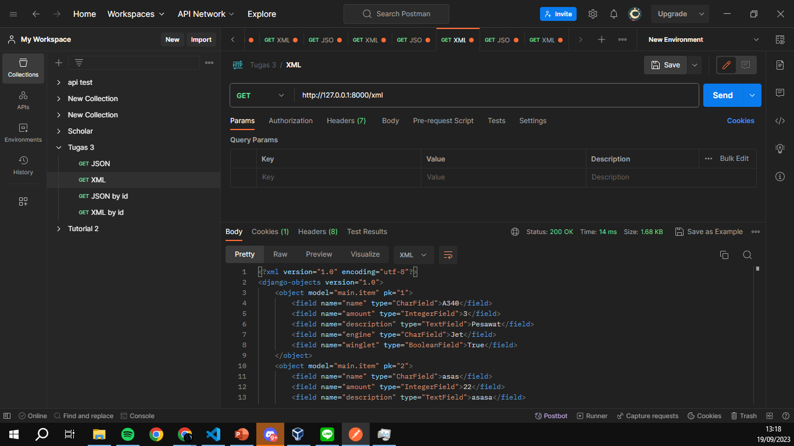

# **Pemrograman Berbasis Platform**

## **Daftar Isi**:

- [**Tugas 1**](#tugas-1)
- [**Tugas 2**](#tugas-2)
- [**Tugas 3**](#tugas-3)

---
## **Tugas 1**

Dapat diakses di [Tugas 1](https://docs.google.com/document/d/18LlGQgYADs7vUt7ymD71-ySPDvE9NGB-37oUFy1Swz0/edit?usp=sharing)

---
## **Tugas 2**

### **Implementasi Model-View-Template (MVT) pada Django**

**Jelaskan bagaimana cara kamu mengimplementasikan checklist di atas secara step-by-step (bukan hanya sekadar mengikuti tutorial).**

- [1] Membuat sebuah proyek Django baru.
  - Memulai dengan membuat direktori baru lalu membuka new terminal pada direktori tersebut. Mengetik django-admin startproject inventory. Lalu akan muncul project bernama inventory dengan file manage.py dan folder inventory.
- [2] Membuat aplikasi dengan nama main pada proyek tersebut.
  - Lalu membuat aplikasi dengan nama main melalui django-admin startapp main. Lalu akan muncul folder bernama main dengan file admin.py, apps.py, models.py, tests.py, dan views.py.
- [3] Melakukan routing pada proyek agar dapat menjalankan aplikasi main.
  - Menambahkan alamat dengan menambahkan "main" di urls.py dari project. Untuk setiap url main akan menggunakan file urls.py di app main.
- [4]  Membuat model pada aplikasi main dengan nama Item dan memiliki atribut wajib sebagai berikut.
  - Menambahkan model dengan nama Item di models.py di app main dengan name bertipe CharField(), amount bertipe IntegerField(), description bertipa TextField(). Lalu melakukan migrasi dengan python manage.py makemigrations dan python manage.py migrate untuk menyimpan model ke database.
- [5] Membuat sebuah fungsi pada views.py untuk dikembalikan ke dalam sebuah template HTML yang menampilkan nama aplikasi serta nama dan kelas kamu.
  - membuat fungsi dengan nama main_view dengan parameter request di views.py pada app main. Lalu fungsi tersebut mengembalikan template html dengan nama main.html terformat yang berisi context yang diisi dengan nama aplikasi dan nama serta kelas dan dummy inventory.
- [6] Membuat sebuah routing pada urls.py aplikasi main untuk memetakan fungsi yang telah dibuat pada views.py
  - Membuat file baru bernama urls.py di app main. Lalu membuat routing dengan alamat yang sama setelah itu mengimport fungsi view di views.py dan menjadikan fungsi view tersebut sebagai tampilan dari alamat urls. Diisi dengan path yang kosong karena nama main sudah ditulis di urls.py project.
- [7] Melakukan deployment ke Adaptable terhadap aplikasi yang sudah dibuat sehingga nantinya dapat diakses oleh teman-temanmu melalui Internet.
  - Melakukan testing dengan python manage.py runserver dan python manage.py test. Lalu melakukan deploy di adaptable. Link Adaptable : [https://plane-inventory.adaptable.app/](https://plane-inventory.adaptable.app/main)
  

**Buatlah bagan yang berisi request client ke web aplikasi berbasis Django beserta responnya dan jelaskan pada bagan tersebut kaitan antara urls.py, views.py, models.py, dan berkas html.**

- Kaitan antara urls.py, views.py, models.py, dan berkas html adalah 
  - urls.py akan mendefinisikan atau memetakan alamat url yang akan diakses dengan viewsnya dalam django. misal alamat url /main akan mengakses fungsi main_view di views.py. 
  - Lalu views.py berfungsi untuk menangani request dari url dan mengembalikan misal data dari database, merender template html, dan mengembalikan response. 
  -  models.py berfungsi untuk mendefinisikan model data yang aplikasi django akan gunakan. Model ini akan disimpan di database dan dapat diakses melalui views.py. misal model Item yang memiliki atribut name, amount, dan description.
  -  berkas.html berisi template html yang akan merender halaman oleh views.py. misal template html yang akan menampilkan data dari context.

Referensi:
- [https://www.technoarchsoftwares.com/blog/django-request-response-cycle/](https://www.technoarchsoftwares.com/blog/django-request-response-cycle/)
- [https://learnbatta.com/blog/understanding-request-response-lifecycle-in-django-29/](https://learnbatta.com/blog/understanding-request-response-lifecycle-in-django-29/)

**Jelaskan mengapa kita menggunakan virtual environment? Apakah kita tetap dapat membuat aplikasi web berbasis Django tanpa menggunakan virtual environment?**
- Alasan mengapa kita menggunakan virtual environment adalah untuk membantu menyimpan dependency dan versi dari package yang dibutuhkan dari project dengan membedakannya melalui environment python yang terisolasi. Hal ini dapat memudahkan kita ketika kita ingin mengirimkan project ke orang lain atau ketika kita ingin mengembangkan project di komputer lain.
- Kita tetap dapat membuat aplikasi web django tanpa membuat virtual environment. Namun, terdapat kelemahan yaitu versi dependency yang digunakan akan menggunakan versi global dari python yang terinstall. Sehingga jika kita ingin melakukan operasi clone dan pull dari project besar di github yang menggunakan versi dependency yang berbeda, maka akan terjadi error karena versi dependency yang berbeda.

Referensi: 
- [https://towardsdatascience.com/why-you-should-use-a-virtual-environment-for-every-python-project-c17dab3b0fd0](https://towardsdatascience.com/why-you-should-use-a-virtual-environment-for-every-python-project-c17dab3b0fd0)
- [https://www.geeksforgeeks.org/python-virtual-environment/#:~:text=A%20virtual%20environment%20is%20a,that%20most%20Python%20developers%20use.](https://www.geeksforgeeks.org/python-virtual-environment/#:~:text=A%20virtual%20environment%20is%20a,that%20most%20Python%20developers%20use.)

**Jelaskan apakah itu MVC, MVT, MVVM dan perbedaan dari ketiganya.**
- pola MVC atau Model-View-Controller adalah pola membuat aplikasi dengan 3 komponen yaitu model, view, controller. Controller dalam MVC akan menangani input dari user dan mengupdate model.View dari MVC akan menampilkan data ke user. Model dari MVC akan menyimpan dan mengakses data. Menggunakan MVC ketika aplikasi perlu membedakan model, controller, dan view. MVC hanya dapat digunakan untuk aplikasi yang besar dan tidak ada pemetaan url. Pada MVC View memberi tahu bagaimana data akan diperlihatkan. 
- MVT atau Model-View-Template adalah pola membuat aplikasi dengan 3 komponen yaitu model, view, template. View dari MVT akan merender model atau data ke template html. Perbedaannya dari MVC adalah Controller MVT sudah ditangani oleh framework, mudah dimodifikasi, url perlu dipetakan, dan bisa digunakan di aplikasi yang kecil dan besar.
- MVVM adalah Model View ViewModel adalah membuat aplikasi dengan model view viewmodel. Controller dari MVVM tidak memperbarui model secara langsung. View dari MVVM menampilkan data ke user. Model dari MVVM menyimpan dan mengakses data. MVVM digunakan ketika aplikasi perlu dibagikan ke desainer dan proses desain dan pengembangan dapat dilakukan secara independen.

Referensi: 
- [https://www.geeksforgeeks.org/difference-between-mvc-and-mvt-design-patterns/](https://www.geeksforgeeks.org/difference-between-mvc-and-mvt-design-patterns/)
- [https://www.geeksforgeeks.org/difference-between-mvc-mvp-and-mvvm-architecture-pattern-in-android/](https://www.geeksforgeeks.org/difference-between-mvc-mvp-and-mvvm-architecture-pattern-in-android/)
  

---

## **Tugas 3**

**Apa perbedaan antara form POST dan form GET dalam Django?**
- Terdapat beberapa perbedaan anatara form POST dan form GET di Django. 
  - Form POST misal pada form login pada django, browser akan mengkonversi data dari form yang diisi menjadi format yang aman atau encoded. Setelah itu data yang encoded dikitim ke server dalam body HTTP request. Lalu server akan mendekode data tersebut dan mengembalikan response. Sedangkan pada post GET data yang diisi pada form akan dikirim pada bentuk string dan digunakan untuk membuat url. URL-nya nanti akan berisi alamat tujuan pengiriman data dan pasangan kunci dan nilai data yang diisi. Jadi misal dalam login data kurang aman.
  - Form POST dalam django dapat mengirimkan data yang lebih beragam daripada form GET. Form POST dapat mengirimkan data dalam bentuk file, sedangkan form GET hanya dapat mengirimkan data dalam bentuk string.
  - form POST lebih banyak digunakan untuk membuat atau mengubah data yang ada di server. Sedangkan form GET lebih banyak digunakan untuk mengambil data dari server.

Referensi: 
- [https://docs.djangoproject.com/en/4.2/topics/forms/#:~:text=Django's%20login%20form%20is%20returned,this%20to%20compose%20a%20URL.](https://docs.djangoproject.com/en/4.2/topics/forms/#:~:text=Django's%20login%20form%20is%20returned,this%20to%20compose%20a%20URL.)

**Apa perbedaan utama antara XML, JSON, dan HTML dalam konteks pengiriman data?**
- HTML (*HyperText Markup Language*) dalam konteks pengiriman data adalah untuk menampilkan data ke user dalam bentuk yang lebih visual dan terstruktur. HTML dapat menampilkan data dalam bentuk yang lebih tervisualisasi seperti tabel, list, gambar, bentuk tulisan yang diformat, dan lain-lain ke halaman web. HTML dapat menampilkan data yang diambil dari server atau data yang sudah ada di client.
- XML (*Extensible Markup Language*) dalam konteks pengiriman data adalah untuk menyimpan, mengirim, dan merekontruksi data yang masih kasar menjadi data yang terstruktur dengan tag untuk penandaan data. XML biasanya digunakan untuk mengirim data antara aplikasi yang berbeda seperti servis web dan sistem perusahaan.
- JSON (*JavaScript Object Notation*) dalam konteks pengiriman data adalah untuk menserialisai dan mengirim data melalui koneksi jaringan seperti internet. Biasanya JSON digunakan untuk mengirim data antara server dan aplikasi web dengan permintaan API. JSON adalah data yang terstruktur karena terdiri dari pasangan key dan value dan dapat dibaca oleh manusia dan komputer.

Referensi:
- [https://www.deltaxml.com/blog/xml/whats-the-relationship-between-xml-json-html-and-the-internet/](https://www.deltaxml.com/blog/xml/whats-the-relationship-between-xml-json-html-and-the-internet/)
- [https://www.w3schools.com/js/js_json_xml.asp](https://www.w3schools.com/js/js_json_xml.asp)

**Mengapa JSON sering digunakan dalam pertukaran data antara aplikasi web modern?**
- JSON sering digunakan dalam pertukaran data antara aplikasi web modern karena
  - Pertama JSON adalah data yang bentuknya simple dan mudah dibaca oleh manusia dan komputer. JSON hanya membutuhkan pasangan key dan value dan juga array agar dapat mudah dimengerti oleh manusia.
  - Kedua JSON adalah data yang kompatibel dengan platform, bahasa pemrograman, dan framework yang berbeda. JSON mendukung sebagian besar browser modern, server web, dan web API yang membuatnya mudah digunakan untuk saling menukar data diantara sistem dan lingkungan yang berbeda.
  -   Ketiga JSON memiliki performa yang lebih efisien sebagai format data untuk aplikasi web daripada XML. JSON memiliki ukuran yang lebih kecil dan struktur yang lebih simple.
  

Referensi:
- [https://www.linkedin.com/advice/3/what-benefits-drawbacks-using-json-data#:~:text=One%20of%20the%20main%20benefits,data%20format%20for%20web%20applications.](https://www.linkedin.com/advice/3/what-benefits-drawbacks-using-json-data#:~:text=One%20of%20the%20main%20benefits,data%20format%20for%20web%20applications.)

**Jelaskan bagaimana cara kamu mengimplementasikan checklist di atas secara step-by-step (bukan hanya sekadar mengikuti tutorial).**
- [1] Membuat input form untuk menambahkan objek model pada app sebelumnya.
  - Membuat file form dengan nama forms.py lalu menambahkan class dengan nama ItemForm yang menjadi form untuk model Item untuk menambahkan objek tambahan ke database yang menambahkan objek dengan mengisi field name, amount, dan description. 
- [2] Tambahkan 5 fungsi views untuk melihat objek yang sudah ditambahkan dalam format HTML, XML, JSON, XML by ID, dan JSON by ID.
  - Menambahkan fungsi views untuk melihat objek dengan format yang ditentukan yaitu HTML, XML, dan JSON.
  - Membuat fungsi untuk menglakukan view pada objek dengan format JSON yaitu dengan membuat fungsi show_json dan show_json_by_id dengan parameter request sebagai request dari user ke django. Lalu untuk fungsi show_json membuat variable data dengan seluruh Item akan diambil dan di kembalikan dalam bentuk json dengan HttpResponse yang dilakukan serialize dengan format json dengan content_type application/json. Lalu untuk fungsi show_json_by_id sama seperti show_json namun dalam membuat variable data, model Item perlu difilter berdasarkan id.
  - Membuat fungsi untuk menglakukan view pada objek dengan format XML yaitu dengan membuat fungsi show_xml dan show_xml_by_id dengan parameter request sebagai request dari user ke django. Lalu untuk fungsi show_xml membuat variable data dengan seluruh Item akan diambil dan di kembalikan dalam bentuk xml dengan HttpResponse yang dilakukan serialize dengan format xml dengan content_type application/xml. Lalu untuk fungsi show_xml_by_id sama seperti show_xml namun dalam membuat variable data, model Item perlu difilter berdasarkan id.
  - Membuat fungsi untuk melakukan view dengan template html adalah dengan membuat fungsi main_view dengan parameter request lalu membuat variable context sebagai isi dari context di html dan context berisi nama aplikasi, nama, kelas, dan isi dari inventory seluruhnya yang mana menggunakan object Item dan all(). Lalu mengembalikan render dengan request, nama template yaitu main.html, dan context.

- [3]  Membuat routing URL untuk masing-masing views yang telah ditambahkan pada poin 2.
  - Pada file urls.py di folder atau app main, menambahkan path "json/" untuk mengakses fungsi show_json untuk melihat seluruh objek dengan format json, path "json/int:id" untuk mengakses fungsi show_json_by_id dan int:id tersebut akan diisi id dari objek Item, path "xml/" untuk mengakses fungsi show_xml untuk melihat seluruh objek dengan format xml, path "xml/int:id" untuk mengakses fungsi show_xml_by_id dan int:id tesebut akan diisi id dari objek Item, dan path "main/" untuk mengakses fungsi main_view yang akan mengembalikan template html.

- [4] Mengakses kelima URL di poin 2 menggunakan Postman, membuat screenshot dari hasil akses URL pada Postman, dan menambahkannya ke dalam README.md.
  - Membuka Postman lalu menambahkan workspace untuk tugas 3 dan menambahkan request untuk ke semua url pada views yang telah dibuat.
  - HTML views
  - 
  - JSON views
  - 
  - XML views
  - 
  - JSON by ID views
  - 
  - XML by ID views
  - 
- [5]  Melakukan add-commit-push ke GitHub.
  - Membuat branch baru bernama development sebagai proses staging dengan *git checkout -b development*.
  - Menambahkan semua file yang telah dibuat dan telah di edit dengan *git add .*
  - Melakukan commit dengan *git commit -m "Menambahkan hasil dari tugas 3"* untuk menyimpan perubahan.
  - Melakukan push ke repository dengan *git push origin development* agar hasil dari tugas 3 dapat dilihat di github.
- [6] Menambahkan pesan "Kamu menyimpan X item pada aplikasi ini" (dengan X adalah jumlah data item yang tersimpan pada aplikasi) dan menampilkannya di atas tabel data. Kalimat pesan boleh dikustomisasi sesuai dengan tema aplikasi, namun harus memiliki makna yang sama.
  - Menambahkan context pada fungsi main_view dengan nama **jumlah_item** yang berisi jumlah item yang ada di database dengan len(items). Lalu pada file html menambahkan kalimat "Kamu menyimpan {{ jumlah_item }} item pada aplikasi ini" di atas tabel data. {{jumlah_item}} akan mengambil value dari pasangan key value di context dari key **jumlah_item**.